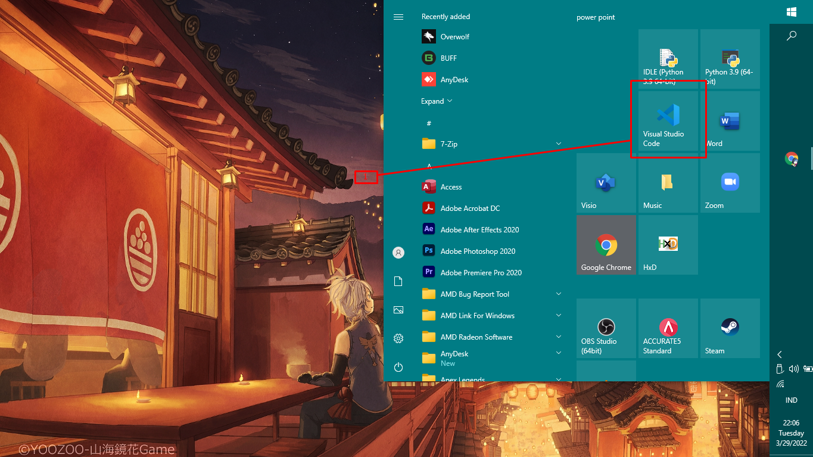

<p align="center">
	PEMROGRAMAN WEB
</p>
<p align="center">
	TUGAS PRATIKUM 3
</p>
<p align="center">
	Dosen Pengampu : Agung Nugroho, M.Kom
</p>
<p align="center"> 
	<b>Tugas untuk memenuhi syarat penilain pada Pert-5</b>
</p>

<p align="center">
	
</p>

<p align="center">
                 Nama  : Jose Fisto
</p>
<p align="center">
                 NIM   : 312010119
</p>
<p align="center">
                 Kelas : TI.20 A.1
</p>

<br/>
<br/>

<p align="center">
	<b>UNIVERSITAS PELITA BANGSA</b>
</p>
<p align="center">
	<b>FAKULTAS TEKNIK</b>
</p>
<p align="center">
	<b>TEKNIK INFORMATIKA</b>
</p>
<p align="center">
	<b>TA 2021 / 2022</b>
</p>

<br></br>

<hr>
</hr>

<br></br>

# Laporan Praktikum 4 - Layout

## Buka Aplikasi / Software Editor
Software editor yang saya gunakan ialah **Visual Studio Code**

<p align="center">
	
</p>
<p align="center">
	Gambar Visual Studio Code
</p>

## Dokumen HTML
Persiapan membuat dokumen HTML dengan nama file **lab4_box.html** seperti berikut.

```html
<!DOCTYPE html>
<html lang="en">
<head>
 <meta charset="UTF-8">
 <meta name="viewport" content="width=device-width, initial-scale=1.0">
 <title>Box Element</title>
</head>
<body>
 <header>
 <h1>Box Element</h1>
 </header>
</body>
</html>
```

### Box Element
Selanjutnya input kode sebagai berikut untuk membuat Box Element sisipkan setelah tag header ``</header>`` dengan menggunakan tag div

```html
<section>
 <div class="div1">Div 1</div>
 <div class="div2">Div 2</div>
 <div class="div3">Div 3</div>
</section>
```

## CSS Float Property
Selanjutnya tambahkan float property untuk membuat float element, dengan kode style css berikut.

```html
<style>
 div {
 float:left;
 padding: 10px;
 }
 .div1 {
 background: red;
 }
 .div2 {
 background: yellow;
 }
 .div3 {
 background: green;
 }
</style>
```

Kemudian buka browser / run untuk melihat hasilnya.

<p align="center">
	
</p>

Properti **Float** digunakan untuk mengatur letak element secara horizontal (left and right). Properti float di bagi menjadi 2 jenis, yaitu ``float: left dan right``
- Float Left, 
  membuat elemen berada di kiri pada pondasi blok layout
- Float Right, 
  membuat elemen berada di kiri pada pondasi blok layout

## Clearfix Element
Clearfix digunakan untuk mengatur element setelah float element. Property clear digunakan untuk
mengaturnya.

Tambahkan element div lainnya seteleah div3 seperti berikut.

```html
<section>
 <div class="div1">Div 1</div>
 <div class="div2">Div 2</div>
 <div class="div3">Div 3</div>
 <div class="div4">Div 4</div>
 <div class="div4">Div 5</div>
 <div class="div4">Div 6</div>
</section>
```

### Clear Left
Kemudian atur property clear dengan menggunakan atribut left, seperti berikut.

```css
.div4 {
 background-color: blue;
 clear: left;
 float: none;
}
```

Selanjutnya buka browser dan refresh kembali.

<p align="center">
	
</p>

Clear left memblok 1 line tidak ada elemen yang akan tertampil pada garis sebelah kiri akan tergusur kebawah.

### Clear Right
Kemudian atur property clear dengan menggunakan atribut **right**, seperti berikut.

```css
.div5 {
 background-color: rgb(27, 27, 32);
 clear: right;
 float: right;
}
```

Selanjutnya Run atau tampilkan hasil :

<p align="center">
	
</p>

Clear right memblok 1 line tidak ada elemen yang akan tertampil pada garis samping kanan akan tergusur kebawah.

### Clear Both
Kemudian atur property clear dengan menggunakan atribut both, seperti berikut.

```css
.div6 {
 background-color: rgb(60, 175, 45);
 clear: both;
 float: left;
}
```

Selanjutnya Run atau tampilkan hasil :

<p align="center">
	
</p>

Clear both gabungan antara kiri dan kanan, dengan menggunakan atribut ini maka semua elemen yang berada kiri dan kanan akan berpindah kebawah.

## Membuat Layout Sederhana
Selanjutnya membuat layout sederhana sesuai pada gambar di bawah tersebut.

<p align="center">
	
</p>

### Folder Baru
Selanjutnya buat folder khusus untuk membuat layout sederhana untuk menerapkan pada contoh gambar di atas.

Buat folder dengan nama **lab4_layout**, dan buat file dalam folder dengan nama **home.html**, dan file css untuk membuat layout **style.css**.

Kode Html **home.html** :

```html
<!DOCTYPE html>
<html lang="en">
<head>
 <meta charset="UTF-8">
 <meta name="viewport" content="width=device-width, initial-scale=1.0">
 <title>Layout Sederhana</title>
 <link rel="stylesheet" href="style.css">
</head>
<body>
 <div id="container">

 </div>
</body>
</html>
```

Kemudian buat kerangka layout dengan semantics element sesuaikan pada gambar berikut.

<p align="center">
	
</p>

Masukkan kode header sesuai kode dibawah ini.

```html
<header>
 <h1>Layout Sederhana</h1>
</header>
<nav>
 <a href="home.html" class="active">Home</a>
 <a href="artikel.html">Artikel</a>
 <a href="about.html">About</a>
 <a href="kontak.html">Kontak</a>
</nav>
<section id="hero"></section>
<section id="wrapper">
 <section id="main"></section>
 <aside id="sidebar"></aside>
</section>
<footer>
 <p>&copy; 2021 - Universitas Pelita Bangsa</p>
</footer>
```

Selanjutnya run dan tampilkan hasilnya.

<p align="center">
	
</p>

Berikut merupakan kode style css untuk tampilan layout untuk struktur header **style.css** :

```css
/* import google font */
@import
url('https://fonts.googleapis.com/css2?family=Open+Sans:ital,wght@0,300;0,400;0,600;0,700;0,800;1,300;1,400;1,600;1,700;1,800&display=swap');
@import
url('https://fonts.googleapis.com/css2?family=Open+Sans+Condensed:ital,wght@0,300;0,700;1,300&display=swap');

/* Reset CSS */
{
 margin: 0;
 padding: 0;
}
body {
 line-height:1;
 font-size:100%;
 font-family:'Open Sans', sans-serif;
 color:#5a5a5a;
}
#container {
 width: 980px;
 margin: 0 auto;
 box-shadow: 0 0 1em #cccccc;
}
/* header */
header {
 padding: 20px;
}
header h1 {
 margin: 20px 10px;
 color: #b5b5b5;
}
```

Selanjutnya jalankan dan tampilkan hasilnya.

<p align="center">
	
</p>

### Navigasi
Mengatur tampilan navigasi dengan kode style css sebagai berikut :

```css
/* navigasi */
nav {
 display: block;
 background-color: #1f5faa;
}
nav a {
 padding: 15px 30px;
 display: inline-block;
 color: #ffffff;
 font-size: 14px;
 text-decoration: none;
 font-weight: bold;
}
nav a.active,
nav a:hover {
 background-color: #2b83ea;
}
```

Kemudian jalankan dan tampilkan hasilnya.

<p align="center">
	
</p>

### Hero Panel
Membuat struktur hero panel sesuaikan kode di bawah berikut pada html dan css :

Kode Html :
```html
<section id="hero">
 <h1>Hello World!</h1>
 <p>Lorem ipsum dolor sit amet, consectetur adipiscing elit. Vestibulum lorem
elit, iaculis innisl volutpat, malesuada tincidunt arcu. Proin in leo fringilla,
vestibulum mi porta, faucibus felis. Integer pharetra est nunc, nec pretium nunc
pretium ac.</p>
 <a href="home.html" class="btn btn-large">Learn more &raquo;</a>
</section>
```

Kode CSS :
```css
/* Hero Panel */
#hero {
 background-color: #e4e4e5;
 padding: 50px 20px;
 margin-bottom: 20px;
}
#hero h1 {
 margin-bottom: 20px;
 font-size: 35px;
}
#hero p {
 margin-bottom: 20px;
 font-size: 18px;
 line-height: 25px;
}
```

Output :

<p align="center">
	
</p>

### Mengatur Layout Main dan Sidebar
Selanjutnya mengatur main content dan sidebar, tambahkan CSS float.
```css
/* main content */
#wrapper {
 margin: 0;
}
#main {
 float: left;
 width: 640px;
 padding: 20px;
}
/* sidebar area */
#sidebar {
 float: right;
 width: 260px;
 padding: 20px;
}
```

### Sidebar Widget
Kemudian selanjutnya menambahkan element lain dalam sidebar.

```html
<aside id="sidebar">
 <div class="widget-box">
 <h3 class="title">Widget Header</h3>
 <ul>
 <li><a href="#">Widget Link</a></li>
 <li><a href="#">Widget Link</a></li>
 <li><a href="#">Widget Link</a></li>
 <li><a href="#">Widget Link</a></li>
 <li><a href="#">Widget Link</a></li>
 </ul>
 </div>
 <div class="widget-box">
 <h3 class="title">Widget Text</h3>
 <p>Vestibulum lorem elit, iaculis in nisl volutpat, malesuada tincidunt
arcu. Proin in leo fringilla, vestibulum mi porta, faucibus felis. Integer
pharetra est nunc, nec pretium nunc pretium ac.</p>
 </div>
</aside>
```
Kemudian tambahkan CSS :
```css
/* widget */
.widget-box {
 border:1px solid #eee;
 margin-bottom:20px;
}
.widget-box .title {
 padding:10px 16px;
 background-color:#428bca;
 color:#fff;
}
.widget-box ul {
 list-style-type:none;
}
.widget-box li {
 border-bottom:1px solid #eee;
 }
.widget-box li a {
 padding:10px 16px;
 color:#333;
 display:block;
 text-decoration:none;
}
.widget-box li:hover a {
 background-color:#eee;
}
.widget-box p {
 padding:15px;
 line-height:25px;
}
```
Output :

<p align="center">
	
</p>

### Mengatur Footer
Selanjutnya mengatur tampilan footer. Tambahkan CSS untuk footer.

```css
/* footer */
footer {
 clear:both;
 background-color:#1d1d1d;
 padding:20px;
 color:#eee;
}
```

Output :

<p align="center">
	
</p>

Menambahkan Elemen lainnya pada Main Content

Kode HTML :

```html
<section id="main">
 <div class="row">
 <div class="box">
 
 <h3>Heading</h3>
 <p>Donec sed odio dui. Etiam porta sem malesuada magna mollis
euismod.</p>
 <a href="#" class="btn btn-default">View detail</a>
 </div>
 <div class="box">
 
 <h3>Heading</h3>
 <p>Donec sed odio dui. Etiam porta sem malesuada magna mollis
euismod.</p>
 <a href="#" class="btn btn-default">View detail</a>
 </div>
 <div class="box">
 
 <h3>Heading</h3>
 <p>Donec sed odio dui. Etiam porta sem malesuada magna mollis
euismod.</p>
 <a href="#" class="btn btn-default">View detail</a>
 </div>
 </div>
</section>
```

Kemudian tambahkan CSS.

```css
/* box */
.box {
 display:block;
 float:left;
 width:33.333333%;
 box-sizing:border-box;
 -moz-box-sizing:border-box;
 -webkit-box-sizing:border-box;
 padding:0 10px;
 text-align:center;
}
.box h3 {
 margin: 15px 0;
}
.box p {
 line-height: 20px;
 font-size: 14px;
 margin-bottom: 15px;
}
box img {
 border: 0;
 vertical-align: middle;
}
.image-circle {
 border-radius: 50%;
}
.row {
 margin: 0 -10px;
 box-sizing: border-box;
 -moz-box-sizing: border-box;
 -webkit-box-sizing: border-box;
}
.row:after, .row:before,
.entry:after, .entry:before {
 content:'';
 display:table;
}
.row:after,
.entry:after {
 clear:both;
}
```

Output :

<p align="center">
	
</p>

### Menambahkan Content Artikel
Selanjutnya membuat content artikel. Tambahkan HTML berikut pada main content

```html
<hr class="divider" />
<article class="entry">
 <h2>First featurette heading.</h2>
 
 <p>Lorem ipsum dolor sit amet, consectetur adipiscing elit. Vestibulum lorem
elit, iaculis in nisl volutpat, malesuada tincidunt arcu. Proin in leo fringilla,
vestibulum mi porta, faucibus felis. Integer pharetra est nunc, nec pretium nunc
pretium ac.</p>
</article>
<hr class="divider" />
<article class="entry">
 <h2>First featurette heading.</h2>
 
 <p>Lorem ipsum dolor sit amet, consectetur adipiscing elit. Vestibulum lorem
elit, iaculis in nisl volutpat, malesuada tincidunt arcu. Proin in leo fringilla,
vestibulum mi porta, faucibus felis. Integer pharetra est nunc, nec pretium nunc
pretium ac.</p>
</article>
```

Kemudian tambahkan CSS.

```css
.divider {
 border:0;
 border-top:1px solid #eeeeee;
 margin:40px 0;
}
/* entry */
.entry {
 margin: 15px 0;
}
.entry h2 {
 margin-bottom: 20px;
}
.entry p {
 line-height: 25px;
}
.entry img {
 float: left;
 border-radius: 5px;
 margin-right: 15px;
}
.entry .right-img {
 float: right;
}
```

Output :

<p align="center">
	
</p>

### Pertanyaan dan Tugas

**1. Tambahkan Layout untuk menu About**

=> buat single layout yang berisi deskripsi, portfolio, dll

**2. Tambahkan layout untuk menu Contact**

=> yang berisi form isian: nama, email, message, dll

Jawaban :

1. Layout untuk menu About

Pertama silahkan buat folder baru dengan nama **About**, selanjutnya buat 2 file dengan nama **about.html** dan **about.css** untuk membuat layout.

Selanjutnya isikan kode untuk html sebagai berikut.

```html
<!DOCTYPE html>
<html>
<head>
	<title>About Me</title>
	<meta charset="utf-8">
	<meta name="viewport" content="width=device-width, initial-scale=1.0">
	<link rel="stylesheet" href="https://pro.fontawesome.com/releases/v5.10.0/css/all.css">
	<link rel="stylesheet" type="text/css" href="about.css">
</head>	
<body>
	<div class="section">
		<div class="container">
			<div class="content-section">
				<div class="title">
					<h1>Jose Fisto</h1>
				</div>
				<div class="content">
					<h3>Web Designer</h3>
					<p>Sedang dalam mempelajari hal yang baru termasuk Web Design, dengan membuat design dari suatu web yang unik sehingga menarik untuk di lihat. Dengan harapan bisa membuat Website Pribadi (Personal Website) yang menarik dan banyak di kunjungi dengan website yang saya olah.
						</p>
					<div class="button">
						<a href="">Selesai</a>
					</div>
				</div>
				<div class="social">
					<a href=""><i class="fab fa-facebook-f"></i></a>
					<a href=""><i class="fab fa-twitter"></i></a>
					<a href=""><i class="fab fa-instagram"></i></a>
				</div>
			</div>
			<div class="image-section">
				
			</div>
		</div>
	</div>

	
</body>
</html>
```

Dan untuk CSS :

```css
@import url('https://fonts.googleapis.com/css2?family=Poppins:wght@200;300;400&display=swap');
*{
	margin:0px;
	padding:0px;
	box-sizing: border-box;
	font-family: 'Poppins', sans-serif;
}
.section{
	width: 100%;
	min-height: 100vh;
	background-color: rgb(133, 121, 121);
}
.container{
	width: 80%;
	display: block;
	margin:auto;
	padding-top: 100px;
}
.content-section{
	float: left;
	width: 55%;
}
.image-section{
	float: right;
	width: 40%;
}
.image-section img{
	width: 100%;
	height: auto;
}
.content-section .title{
	text-transform: uppercase;
	font-size: 28px;
}
.content-section .content h3{
	margin-top: 20px;
	color:#5d5d5d;
	font-size: 21px;
}
.content-section .content p{
	margin-top: 10px;
	font-family: sans-serif;
	font-size: 18px;
	line-height: 1.5;
}
.content-section .content .button{
	margin-top: 30px;
}
.content-section .content .button a{
	background-color: #532e2e;
	padding:12px 40px;
	text-decoration: none;
	color:#fff;
	font-size: 25px;
	letter-spacing: 1.5px;
}
.content-section .content .button a:hover{
	background-color: #642121;
	color:#fff;
}
.content-section .social{
	margin: 40px 40px;
}
.content-section .social i{
	color:#6d1818;
	font-size: 30px;
	padding:0px 10px;
}
.content-section .social i:hover{
	color:#3d3d3d;
}
@media screen and (max-width: 768px){
	.container{
	width: 80%;
	display: block;
	margin:auto;
	padding-top:50px;
}
.content-section{
	float:none;
	width:100%;
	display: block;
	margin:auto;
}
.image-section{
	float:none;
	width:100%;
	
}
.image-section img{
	width: 100%;
	height: auto;
	display: block;
	margin:auto;
}
.content-section .title{
	text-align: center;
	font-size: 19px;
}
.content-section .content .button{
	text-align: center;
}
.content-section .content .button a{
	padding:9px 30px;
}
.content-section .social{
	text-align: center;
}
```

Setelah itu jalankan dan tampilkan output :

<p align="center">
	
</p>

2. Layout untuk menu Contact

Sama seperti sebelumnya buat folder dengan nama **Kontak**, lalu buat 2 file dengan nama **kontak.html** dan **style_kontak.css**.

Selanjutnya isikan kode html sebagai berikut.

```html
<!DOCTYPE html>
<html>
<head>
	<title>Contact</title>
	<link rel="stylesheet" type="text/css" href="style_kontak.css">
	<link href="https://fonts.googleapis.com/css?family=Quicksand&display=swap" rel="stylesheet">
	<meta name="viewport" content="width=device-width,initial-scale=1.0,minimum-scale=1.0,maximum-scale=1.0">
</head>
<body>
	<div class="container">
		<div class="contact-box">
			<div class="left"></div>
			<div class="right">
				<h2>Kontak Saya</h2>
				<input type="text" class="field" placeholder="Nama Anda">
				<input type="text" class="field" placeholder="Email Anda">
				<input type="text" class="field" placeholder="Telelpon +62">
				<textarea placeholder="Pesan" class="field"></textarea>
				<button class="btn">Kirim</button>
			</div>
		</div>
	</div>
</body>
</html>
```

Dan untuk layout.

```css
*{
	padding: 0;
	margin: 0;
	box-sizing: border-box;
	font-family: 'Quicksand', sans-serif;
}

body{
	height: 100vh;
	width: 100%;
}

.container{
	position: relative;
	width: 100%;
	height: 100%;
	display: flex;
	justify-content: center;
	align-items: center;
	padding: 20px 100px;
}

.container:after{
	content: '';
	position: absolute;
	width: 100%;
	height: 100%;
	left: 0;
	top: 0;
	background: url("img/aj.png") no-repeat center;
	background-size: cover;
	filter: blur(50px);
	z-index: -1;
}
.contact-box{
	max-width: 850px;
	display: grid;
	grid-template-columns: repeat(2, 1fr);
	justify-content: center;
	align-items: center;
	text-align: center;
	background-color: #fff;
	box-shadow: 0px 0px 19px 5px rgba(0,0,0,0.19);
}

.left{
	background: url("img/aj.png") no-repeat center;
	background-size: cover;
	height: 100%;
}

.right{
	padding: 25px 40px;
}

h2{
	position: relative;
	padding: 0 0 10px;
	margin-bottom: 10px;
}

h2:after{
	content: '';
    position: absolute;
    left: 50%;
    bottom: 0;
    transform: translateX(-50%);
    height: 4px;
    width: 50px;
    border-radius: 2px;
    background-color: #999728;
}

.field{
	width: 100%;
	border: 2px solid rgba(0, 0, 0, 0);
	outline: none;
	background-color: rgba(230, 230, 230, 0.6);
	padding: 0.5rem 1rem;
	font-size: 1.1rem;
	margin-bottom: 22px;
	transition: .3s;
}

.field:hover{
	background-color: rgba(0, 0, 0, 0.1);
}

textarea{
	min-height: 150px;
}

.btn{
	width: 100%;
	padding: 0.5rem 1rem;
	background-color: #a9cc47;
	color: #fff;
	font-size: 1.1rem;
	border: none;
	outline: none;
	cursor: pointer;
	transition: .3s;
}

.btn:hover{
    background-color: #838f1b;
}

.field:focus{
    border: 2px solid rgba(30,85,250,0.47);
    background-color: #fff;
}

@media screen and (max-width: 880px){
	.contact-box{
		grid-template-columns: 1fr;
	}
	.left{
		height: 200px;
	}
}
```

Selanjutnya jalankan dan tampilkan hasil.

<p align="center">
	
</p>

Dan langkah terakhir menglink pada bagi menu home.

1. buka file **home.html** yang telah di buat sebelumnya

2. Jika sudah pada bagian menu atau tag **nav**, ganti href dengan nama file html yang telah di buat sebelumnya seperti contoh sebagai berikut

<p align="center">
	
</p>

<p align="center">
	
</p>

3. Jika sudah save dan buka dan lakukan tes untuk membuka menu about dan contact
4. Sekian terimakasih